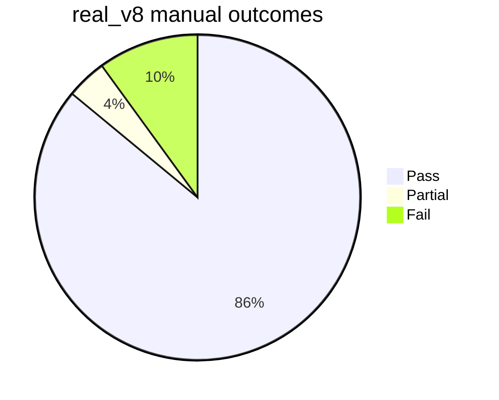

# real_v8 Codex Cloud Eval Report

Run date: 2026-05-13
Run ID: `real-v8-codex-cloud-20260513-112315`
Dataset: `real_v8`
Model/provider: `gpt-5.5` via Codex login
Browser mode: Browser Use cloud only
Concurrency: 25 fixed slots
Manual judging: 5 subagents, 20 tasks each

Companion implementation plan: `docs/real-v8-fix-implementation-plan.md`

## Executive Summary

The current strict manually judged score is **86/100**.

Partial results are counted as failures for the benchmark score. If partials are scored as half credit, this run is **88/100**.

```text
Strict manual score

Pass     86 | ##################################################
Partial   4 | ##
Fail     10 | ######
```



The raw runner result was more optimistic:

| View | Pass | Partial | Fail | Pending | Score |
|---|---:|---:|---:|---:|---:|
| Runner manifest | 93 | n/a | 6 | 1 | 93% local-ok |
| Manual strict judge | 86 | 4 | 10 | 0 | 86% |
| Manual half-credit | 86 | 4 | 10 | 0 | 88% |

The 7 point difference comes from 8 runner-successful tasks that were manually bad or partial, offset by 1 runner-pending task that had actually produced a valid output artifact.

## Run Hygiene

The local Chrome/CDP leak was fixed before this run and guarded during execution.

- A 3-task canary passed cleanly before the full run.
- Full run leak scan found no matches for `127.0.0.1`, `remote=local`, or `AF_UNIX path too long`.
- Browser logs used `wss://...browser-use.com` endpoints and short `/tmp/lbe/...` runtime sockets.
- The first contaminated attempt should not be counted. This report uses only `real-v8-codex-cloud-20260513-112315`.

Relevant hardening already present in this branch:

- Short per-task runtime paths are created in `dataset_task_paths` to avoid macOS Unix socket path limits: `crates/browser-use-cli/src/main.rs:2571`.
- Dataset tasks set `BH_RUNTIME_DIR`, `BH_TMP_DIR`, `LLM_BROWSER_OUTPUTS_DIR`, and `LLM_BROWSER_BROWSER_MODE`: `crates/browser-use-cli/src/main.rs:2622`.
- `exec_command` disables local CDP env inside virtual-home dataset workspaces: `crates/browser-use-core/src/tools/command.rs:122`.
- The Python browser worker patches browser-harness admin calls so cloud mode cannot silently fall back to local CDP: `python/llm_browser_worker/worker.py:432`.

## Failure Modes

### Hard Failures

| Task | Runner status | Failure mode | What happened |
|---:|---|---|---|
| 1 | success | empty output | Final answer was only `Done`; no useful artifact was present. |
| 6 | provider failed | file artifact/read failure | Agent failed reading a downloaded JPG path that did not exist locally. |
| 9 | success | wrong data shape | Returned location pages instead of individual property listing URLs and names. |
| 17 | provider failed | max turns | Henrico court-records task exceeded provider turns with no final JSON. |
| 52 | success | empty output | Final answer was only `Done`; no Markdown article list or output file present. |
| 66 | provider failed | max turns | Volusia property appraiser multi-name search exceeded provider turns. |
| 72 | provider failed | max turns | ND oil/gas operator ID search exceeded provider turns. |
| 77 | success | empty output | Screenshots existed, but no requested business analysis/recommendations. |
| 88 | provider failed | broken pipe and incomplete output | Beverly Hills surgeon extraction hit provider pipe failure and local output was incomplete. |
| 98 | provider failed | max turns | Pulaski County tax bill task exceeded provider turns without final PDF/result. |

### Partials

| Task | Failure mode | What was missing |
|---:|---|---|
| 76 | materially incomplete | Returned one valid Spanish Berlin option and one explicitly non-Spanish option. |
| 87 | incomplete output | Returned 7 food trucks when 200 were requested. |
| 96 | missing fields | Covered all 10 BuiltFirst URLs, but several records lacked requested website/category data. |
| 100 | wrong site data | Returned 20 records per platform, but Galaxus entries included non-supplement products. |

### Counts By Category

| Category | Tasks | Count | Score impact |
|---|---|---:|---:|
| Empty or placeholder final answer accepted | 1, 52, 77 | 3 | -3 |
| Provider turn budget exceeded | 17, 66, 72, 98 | 4 | -4 |
| Wrong or incomplete extraction | 9, 76, 87, 96, 100 | 5 | -5 strict, -2 half-credit |
| Browser/provider infrastructure | 6, 88 | 2 | -2 |
| Runner hang after artifact output | 26 | 1 | runner false negative |

## What Actually Went Wrong

### 1. Runner `ok` is too weak

The dataset runner marks a task successful when the session is done, no provider error exists, and `final_result` is present:

- `crates/browser-use-cli/src/main.rs:2308` reads events and final result.
- `crates/browser-use-cli/src/main.rs:2322` defines `ok`.

That accepts `Done.` as a valid benchmark result. This directly explains tasks 1, 52, and 77. It also makes the manifest score unsuitable as a quality score.

### 2. Final answer and artifact contract is ambiguous

Some passing tasks wrote useful files while the final answer was only `Done.`. Task 46 passed manually because output artifacts existed, but task 52 and task 77 failed because there was no matching deliverable.

The agent needs a stricter contract:

- For extraction tasks, final answer should point to `/home/user/outputs/result.json` or include the answer.
- `Done.` should be treated as suspicious unless there is a declared output artifact matching the task.
- Large JSON should live in artifacts, but the final answer must still identify the path and provide a short sample/count.

### 3. No per-task wall clock or heartbeat in the fixed-concurrency scheduler

The scheduler keeps a fixed active count and waits on a channel receive:

- Active task launch loop: `crates/browser-use-cli/src/main.rs:2159`.
- Blocking receive: `crates/browser-use-cli/src/main.rs:2202`.

Task 26 wrote `outputs/result.json` and `.final_answer.json` with 668 stores, but the runner never recorded completion. The full eval had to be manually stopped with one pending task. This is a runner reliability issue, not an agent quality issue.

### 4. Retry classification is too narrow

`--max-attempts 2` was configured, but every task ran only once. The retry gate only retries errors matching `is_transient_provider_failure`:

- Attempt loop: `crates/browser-use-cli/src/main.rs:2248`.
- Retry decision: `crates/browser-use-cli/src/main.rs:2259`.
- Transient classifier: `crates/browser-use-cli/src/main.rs:2984`.

Current misses:

- `Broken pipe (os error 32)` did not retry.
- `agent exceeded maximum provider turns` did not retry or adapt the budget.
- The task 6 missing downloaded file did not retry.

That leaves recoverable infrastructure failures counted as final failures.

### 5. Complex extraction tasks still need better bounded strategies

The failed or partial extraction tasks are mostly large or awkward:

- court/property/tax portals
- county assessor search
- large directory extraction
- product categorization across retail search pages
- huge specialty matrix extraction

These need stronger heuristics: API-first discovery, pagination planning, result-count checks, and task-specific validation before final answer.

## Prioritized Fix Plan

| Priority | Fix | Expected impact | Why |
|---|---|---:|---|
| P0 | Add runner task wall-clock timeout, heartbeat, and artifact salvage | +1 score, major reliability | Prevents task 26-style stuck runs and lets completed artifacts be recorded. |
| P0 | Reject placeholder final answers for benchmark tasks | +3 potential | Forces retry/failure for tasks 1, 52, 77 instead of false success. |
| P0 | Make final answer/artifact contract explicit and enforced | +3 to +5 potential | Large outputs can stay in files, but final answers must point to them and provide counts/examples. |
| P1 | Retry `Broken pipe`, missing local artifact reads, and provider stream failures | +1 to +2 potential | Task 88 and possibly task 6 should get a clean retry. |
| P1 | Add adaptive max-turn recovery | +2 to +4 potential | Tasks 17, 66, 72, 98 failed by budget. Retry with a compacted plan or higher task budget. |
| P1 | Add schema/output validators for datasets | +4 potential | Catches wrong granularity, missing fields, and too-few rows before finalizing. |
| P2 | Add extraction playbooks for maps/directories/tax/property portals | +2 to +5 potential | Addresses the long-tail failures where the agent wanders or under-collects. |
| P2 | Reduce tool output bloat and require artifact-first large outputs | +1 to +3 potential | Lowers provider turn pressure and broken pipes on large scrape tasks. |
| P3 | Persist judge results as JSONL and generate this report automatically | Quality-of-life | Speeds future runs and makes scoring reproducible. |

## Suggested Implementation Details

### P0: Runner Timeout And Artifact Salvage

Add per-task wall-clock tracking around spawned dataset workers.

Behavior:

1. Record `started_at` when launching each task.
2. If a task exceeds a configured wall-clock timeout, terminate its session/worker.
3. Inspect its task attempt directory for:
   - `outputs/result.json`
   - `artifacts/.final_answer.json`
   - non-empty requested output files
4. If a valid final artifact exists, record a result with `ok: true`, `runner_status: salvaged`.
5. Otherwise record `ok: false`, `error_type: runner_timeout`.

This directly fixes the task 26 class and prevents long evals from hanging forever.

### P0: Final Answer Gate

For dataset runs, treat these as invalid unless an output artifact exists and is declared:

- `Done.`
- `done`
- empty string
- tiny final answers below a configurable threshold for extraction tasks

Implementation point: after `result_from_events` in `dataset_attempt_result`, inspect `final_result` and task/output artifacts before setting `ok`.

### P1: Retry Classifier

Expand retry handling:

- Add `broken pipe` to transient provider errors.
- Add missing-file artifact reads as retryable once.
- Treat max-turn failures as `budget_exhausted`, not plain provider failure.
- On budget exhaustion, rerun with either:
  - higher `max_turns`, or
  - a compacted "continue from artifacts" prompt, or
  - a targeted retry strategy for the same task.

### P1: Dataset Validators

Add optional validators per task class:

- Expected output file exists.
- Structured JSON parses.
- Required fields are non-empty.
- Minimum row count or requested count is met.
- If task asks for URLs, URLs are present.
- If task asks for screenshots, screenshot files exist and are non-empty.

This would catch tasks 1, 9, 52, 77, 87, 96, and 100 before they become false successes.

### P2: Browser/Artifact Download Handling

Task 6 failed because the agent attempted to read a downloaded JPG path that was absent:

```text
downloads/20260423-5013_DOC_04_Medidas Cautelares Ballenas Golfo de California en-US.JPG
```

Fix direction:

- Route all browser downloads through a known per-task downloads directory.
- Emit a download event with both browser-side and local file paths.
- Copy or symlink downloaded files into `/home/user/outputs` when referenced.
- Make file-read errors model-visible and recoverable instead of fatal provider errors where possible.

## Expected Upside

Realistic near-term target: **90-92/100**.

That should be reachable by:

- salvaging task 26,
- retrying broken pipe/download failures,
- rejecting placeholder `Done.` answers,
- adding one validation/retry loop.

More ambitious target: **93-96/100**.

That likely requires:

- adaptive max-turn recovery,
- stronger large-directory extraction playbooks,
- schema validators,
- better artifact-first output discipline,
- lower-concurrency confirmation runs for provider-sensitive tasks.

## Evidence Paths

Primary manifest:

```text
/tmp/real-v8-codex-cloud-20260513-112315/state/dataset-runs/real-v8-codex-cloud-20260513-112315.json
```

Task artifacts:

```text
/tmp/real-v8-codex-cloud-20260513-112315/state/dataset-run-files/real-v8-codex-cloud-20260513-112315
```

Runner log:

```text
/tmp/real-v8-codex-cloud-20260513-112315/logs/dataset-run.log
```

## Bottom Line

The branch can already run `real_v8` at 25-way cloud-browser concurrency without touching local Chrome. The main remaining gap is not raw browser connectivity; it is eval-quality control around final answers, retries, hung tasks, and validation.

The highest-leverage engineering work is:

1. Make the runner impossible to hang.
2. Make `Done.` insufficient for dataset success.
3. Retry recoverable provider and artifact failures.
4. Validate structured outputs before finalizing.
